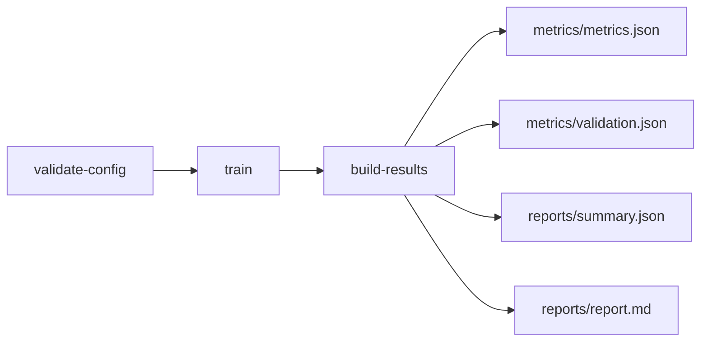
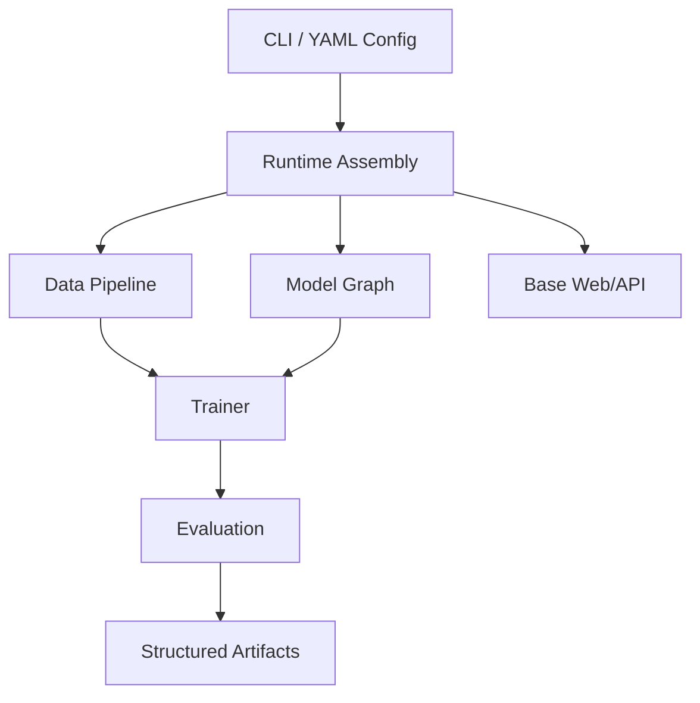

# MedFusion OSS

[](https://www.python.org/downloads/)
[](LICENSE)

**Open-core medical AI runtime for training, validation, and reproducible result artifacts.**

MedFusion OSS 聚焦一件事：把医学 AI 的研究流程从“能训练”升级到“可验证、可复盘、可交付”。

> 核心定位：**executable runtime + structured validation outputs**
>
> 当前正式版 preview 的最稳说法：
> **研究运行时 + GUI 模型搭建主链 + 真实结果闭环**

---

## 正式版方向

如果从正式版产品壳来理解 MedFusion，当前最合理的说法是：

> **GUI-first for users, engine-first internally, Web-first for deployment。**

这意味着：

- 正式版默认从 `medfusion start` 进入图形界面，而不是让普通用户先从 CLI 和 YAML 开始
- Web 前台负责把“问题定义 -> 模型搭建 -> 训练 -> 结果”这条主链讲清楚
- runtime / CLI 仍然是执行真源，继续负责可预测、可审计、可回放、可复盘的训练与产物生成
- 节点式编辑是长期重要方向，但当前阶段更适合作为高级模式，而不是默认首页

换句话说，当前正式版不是在承诺“任意模型都能可视化点出来”，而是在把**GUI 模型搭建主链 + 真实结果闭环**收成一个可推出的产品壳。

当前已经能成立的主链是：

`问题定义 / 高级模式图编译 -> contract 校验 -> 真实训练任务 -> 结果回流 -> 结果详情`

---

## 部署形态

当前正式版建议按三种形态来理解：

### 1. 本机浏览器模式

- 前端：React 构建产物由 FastAPI 直接提供
- API/BFF：FastAPI
- 训练执行：本地 Python subprocess worker
- metadata：SQLite
- artifacts：本地文件系统
- 用户自定义模型：默认落在本机用户数据目录中的本地文件系统，而不是浏览器缓存

这是当前最推荐、最完整、最可复现的正式版入口。

### 2. 私有服务器 / 自建部署模式

- 前端：静态前端可独立部署，也可继续由 FastAPI 承载
- API/BFF：FastAPI
- 训练执行：独立 Python worker，建议部署到 GPU 机器
- metadata：PostgreSQL
- artifacts：共享文件系统或对象存储
- 用户自定义模型：优先保留为“当前用户私有来源”，后续再决定是否开放团队共享

这条线的重点不是换技术栈，而是把 Web 进程和训练执行进程拆开。

### 3. 托管云模式

- 前端：静态前端 + 网关 / CDN
- API/BFF：FastAPI
- 训练执行：多 Python worker
- metadata：PostgreSQL
- artifacts：S3 / OSS / MinIO

这仍然是同一条 runtime 主链，只是部署拓扑和多租户能力更强。

无论哪种形态，当前都不建议引入 Node 后端。这个项目的复杂度中心在训练、编排、结果资产和后续 AI 接入，而不是 SSR。

当前模型搭建层的推荐理解也已经收口：

- 官方模型真源集中在模型数据库
- 模型数据库同时记录两类对象：
  - 最小组织单元（黑盒组件）
  - 成品模型（由黑盒组件组成的命名模型）
- 独立评估模块现在已经作为单独页面开放，用于基于已有 `config + checkpoint` 单独补跑 `validation / summary / report`，并可选导入结果后台
- 用户自定义模型当前先保留为本地私有来源，默认落盘到客户主机本地文件系统
- 当前自定义模型文件带 `schema_version`，并使用本地 git 快照保留保存 / 删除 / 恢复历史
- 历史保留策略当前按“整个本机自定义模型库”统一配置；默认按条数保留，最多 40 条，并尽量保证当前仍存在的模型至少保留最近若干条历史
- 但当前仍按内部状态文件处理，不承诺用户级导入/导出格式稳定性
- 当前从历史版本恢复时，默认行为是覆盖当前模型，并额外保留一条新的本地 git 记录
- 回收站当前只允许恢复，不提供手动“彻底清除”；真正清理由保留策略自动完成
- 当前 UI 偏好设置也按“整台机器一套”处理，默认假设客户主机上的这套软件由单个用户使用
- 语言、主题和历史显示方式都已按机器级本地文件设置处理，不再依赖浏览器缓存作为主存储
- 当前 `friendly / technical` 显示切换先只作用于自定义模型的版本历史相关页面，不扩散成全局术语切换
- 设置页当前提供“恢复默认设置”，可一键把语言、主题和历史显示方式恢复到默认值
- 如果客户曾在旧版本里通过浏览器缓存设置过语言或主题，新版本会在机器级设置仍为默认值时做一次性迁移
- 高级模式继续保留，但其角色已经收口为“官方模型数据库的高级编辑视图”，不是另一套独立真源
- 当前 roadmap 正在执行“先做 1，再有节制逼近 2”的 contract 路线：
  - 先把对象、结构规则、preset hint、warning metadata 收回模型数据库真源
  - 编译器继续保留为薄的 Python 解释层
  - 暂不把完整 component -> RunSpec patch 一次性全部元数据化

发布前如果你想确认“这版到底能不能对外展示”，推荐直接看：

- [正式版 Smoke Matrix](docs/contents/playbooks/release-smoke-matrix.md)
- [发布前清单](docs/contents/tutorials/deployment/production.md)

---

## 为什么是 MedFusion OSS

很多项目能把模型跑起来，但训练后的结果组织、验证结构和报告产物不稳定。
MedFusion OSS 优先保证主链闭环：

- 配置先校验：`validate-config`
- 训练可执行：`train`
- 结果可复盘：`build-results`

标准输出包括：
`logs/history.json` / `metrics/metrics.json` / `metrics/validation.json` /
`reports/summary.json` / `reports/report.md` + 可视化 artifacts。

正式版结果详情建议统一按四层阅读：

- 结论层：`summary.json` 的主结论与主要指标
- 指标层：`metrics.json` 与 `validation.json` 的稳定性和风险点
- 可视化层：ROC / 混淆矩阵 / 注意力等图示 artifact
- 文件层：可下载、可复核、可交付的落盘文件

如果 run 来自高级模式，结果详情还应明确来源链：
`source_type`、`entrypoint`、`blueprint_id`，以及该 blueprint 对应的 `recommended_preset` 与 `compile_boundary`。

---

## OSS 与 Pro 的关系

MedFusion 采用 open-core 路线：

- **OSS = upstream core runtime / workbench（像 Chromium）**
- **Pro = commercial distribution / doctor-facing workbench（像 Chrome）**

OSS 不是 demo 壳，而是长期技术主干。

---

## 快速开始

如果你的目标是“自己新建一份 YAML 模型配置”，先看
[如何新建模型与 YAML](docs/contents/getting-started/model-creation-paths.md)。
当前官方边界是：

- 普通用户复制主链模板
- 高级用户走 Builder / 代码做结构实验
- 真正新的能力先扩 runtime，再扩 YAML

> 以下命令默认在 **MedFusion OSS 仓库根目录** 执行。
> `--config configs/...` 这类官方相对配置路径，在你从仓库外执行时也会优先回退到这个仓库根目录。
> `logging.output_dir` 和 `--output-dir` 这类相对输出路径也会统一锚定到这个仓库根目录，而不是你当前 shell 的 `cwd`。
> `csv_path` / `image_dir` 这类主链数据路径，同样会按仓库根目录稳定解析。

如果你完全没有私有数据，推荐先走“公共数据快速验证”。
先成功跑通一次，再迁移到自己的 YAML，阻力最小。

如果你想要一个固定的本地 / CI 自检入口，而不是手敲整串命令，直接运行：

```bash
bash test/smoke.sh
```

它会按官方 BreastMNIST quickstart 主链执行 `prepare -> validate-config -> train -> build-results`，并检查标准产物是否都已经落盘。

如果你更希望从 Web 入口开始理解这套系统，当前默认入口是：

```bash
uv run medfusion start
```

它会先把你带到 `Getting Started` 引导页，帮助你完成第一次成功闭环；真正长期做实验和复现时，仍然建议回到 `YAML + medfusion` 这条主链。

如果你希望从 CLI 直接完成一次完整闭环，当前推荐命令是：

```bash
uv run medfusion run --config configs/starter/quickstart.yaml
```

它会默认执行 `validate-config -> train -> build-results`。如果你需要分阶段调试，仍然可以继续单独使用 `validate-config`、`train` 和 `build-results`。

### 1) 公共数据快速验证（推荐第一步）

```bash
uv run medfusion public-datasets list
uv run medfusion public-datasets prepare medmnist-breastmnist --overwrite
uv run medfusion run --config configs/public_datasets/breastmnist_quickstart.yaml
```

### 2) 本地数据路径

```bash
uv run medfusion run --config configs/starter/quickstart.yaml
```

这里的 `validate-config` 不只是“看有没有报错”。
它现在会先把这份 YAML 对应的主线 contract 打印出来，包括：

- 当前会调用的训练 schema / `model_type`
- 关键模块组合，例如 `vision_backbone`、`fusion_type`
- 结果输出目录与 `best.pth`、`summary.json`、`validation.json`
- 下一步建议命令：`train`、`build-results`、`import-run`

也就是说，新手先看 `validate-config` 的输出，就能知道“这份 YAML 到底会跑什么、结果会写到哪里”，不需要先翻源码。

如果你需要分阶段排查问题，再退回下面这条拆解命令链：

```bash
uv run medfusion validate-config --config configs/starter/quickstart.yaml
uv run medfusion train --config configs/starter/quickstart.yaml
uv run medfusion build-results \
  --config configs/starter/quickstart.yaml \
  --checkpoint outputs/quickstart/checkpoints/best.pth
```

### 3) 专项 demo：三相 CT + 临床小样本

`v1` demo 适用于小样本可行性验证，不用于宣称泛化性能。

输入要求：

- `manifest CSV`：每行一个病例，至少包含 `case_id`、三相 DICOM 目录、`mvi_binary`
- 三相目录：`arterial_series_dir`、`portal_series_dir`、`noncontrast_series_dir`
- 临床字段：由 demo config 中 `data.clinical_feature_columns` 指定

运行方式：

```bash
uv run medfusion validate-config --config configs/demo/three_phase_ct_mvi_dr_z.yaml
uv run medfusion train --config configs/demo/three_phase_ct_mvi_dr_z.yaml
uv run medfusion build-results \
  --config configs/demo/three_phase_ct_mvi_dr_z.yaml \
  --checkpoint outputs/three_phase_ct_mvi_dr_z/checkpoints/best.pth
```

说明：

- 主线输出会生成 `logs/history.json`、`metrics/metrics.json`、
  `metrics/validation.json`、`reports/summary.json`、`reports/report.md`
- `risk score` 当前表示 `MVI-related risk score`
- 它不是生存风险，也不是临床可直接使用的评分
- 热图默认会导出两种解释视角：
  `predicted_class` 用于解释“模型为什么给出当前最终判断”，
  `positive_class` 用于解释“如果专门寻找 MVI 阳性证据，模型会关注哪里”

热图视角说明：

- `predicted_class`
  更接近“为什么这次报告写成这样”
- `positive_class`
  更接近“如果从 MVI 风险角度补充观察，哪里更可疑”
- 两者不是重复图片，而是在回答两个不同问题
- 对医生展示时，建议把 `predicted_class` 作为主图，
  把 `positive_class` 作为“阳性风险补充解释图”
- 对当前 demo 而言，只要某个病例被纳入热图导出，
  每一期默认都会生成这两个视角；
  但如果该病例的 `predicted_class` 本身就是阳性，
  那么两种视角在语义和图像上可能接近甚至重合

---

## 预期输出（3 分钟自检）

运行完成后，你至少应该看到类似结构：

```text
outputs/<run_name>/
├── checkpoints/
│   └── best.pth
├── logs/
│   └── history.json
├── metrics/
│   ├── metrics.json
│   └── validation.json
├── reports/
│   ├── summary.json
│   └── report.md
└── artifacts/
```

`summary.json` 会包含可直接复盘/汇报的结构化信息（示例）：

```json
{
  "run_name": "quickstart",
  "task": "classification",
  "primary_metric": "auc",
  "primary_metric_value": 0.87,
  "checkpoint": "outputs/quickstart/checkpoints/best.pth",
  "artifacts": ["metrics.json", "validation.json", "report.md"]
}
```

---

## Non-goals（当前不承诺）

MedFusion OSS 当前不是：

- 通用公开 benchmark 排行平台
- 临床部署/医疗器械合规软件
- 可视化拖拽式 AutoML 产品

它现在的目标很明确：**把训练与验证结果闭环做扎实，且可复盘、可对接。**

---

## 运行主链



---

## 架构概览（README 简版）



工程接入时建议重点关注两类边界：
- **可替换点**：`backbone / fusion / head / trainer`
- **契约点**：config schema + artifact schema（`metrics/metrics.json / metrics/validation.json / reports/summary.json / reports/report.md`）

代码级架构详解见：
- [CORE_RUNTIME_ARCHITECTURE.md](docs/contents/architecture/CORE_RUNTIME_ARCHITECTURE.md)
- [OUTPUTS_DIRECTORY_GOVERNANCE.md](docs/contents/architecture/OUTPUTS_DIRECTORY_GOVERNANCE.md)

---

## 项目结构

```text
oss/
├── med_core/      # 核心 runtime（models, trainers, evaluation, cli, web）
├── configs/       # 配置模板
├── tests/         # 测试
├── examples/      # 示例
├── scripts/       # 回归与辅助脚本
└── docs/          # 文档
```

---

## 开发与验证

```bash
# 日常本地预检
bash scripts/full_regression.sh --quick

# 提交前本地 smoke / handoff
bash scripts/full_regression.sh --ci

# 更完整的本地非-pytest 检查
bash scripts/full_regression.sh --full

# 正式版 smoke（本机 / Docker）
uv run python scripts/release_smoke.py --mode local
```

`pytest` 当前固定由 GitHub Actions CI 执行：
- [CI Workflow](.github/workflows/ci.yml)

如果 CI 失败，优先看 GitHub Actions 日志；本机装了 `gh` 时也可以直接运行：

```bash
bash scripts/inspect_ci_failure.sh
```

---

## 文档入口

- [如何新建模型与 YAML](docs/contents/getting-started/model-creation-paths.md)
- [快速上手](docs/contents/getting-started/quickstart.md)
- [CLI & Config 工作流](docs/contents/getting-started/cli-config-workflow.md)
- [公共数据集路径](docs/contents/getting-started/public-datasets.md)
- [Examples Guide](examples/README.md)
- [文档站首页](docs/README.md)
- [任务手册（按目标执行）](docs/contents/playbooks/README.md)
- [结果解读与交付检查](docs/contents/playbooks/result-interpretation-checklist.md)
- [高级模式结果回流演示路径](docs/contents/playbooks/external-demo-path.md)
- [Why MedFusion OSS（定位对比）](docs/contents/guides/core/why-medfusion-oss.md)

---

## 贡献与许可

- 贡献指南：[CONTRIBUTING.md](CONTRIBUTING.md)
- 许可证：[MIT](LICENSE)
- Issues: https://github.com/iridyne/medfusion/issues
- Discussions: https://github.com/iridyne/medfusion/discussions
