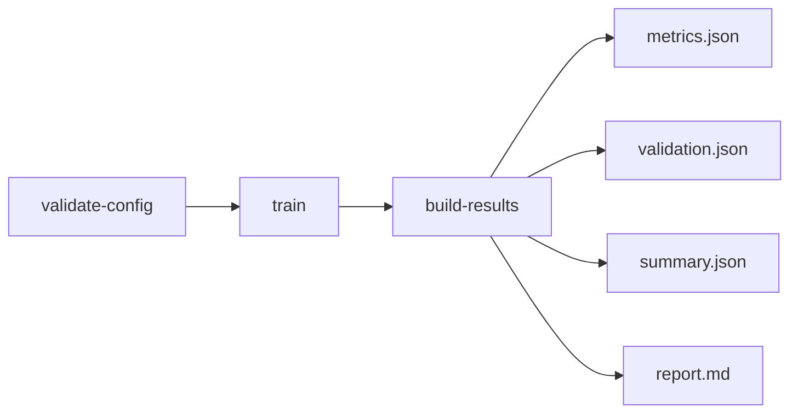
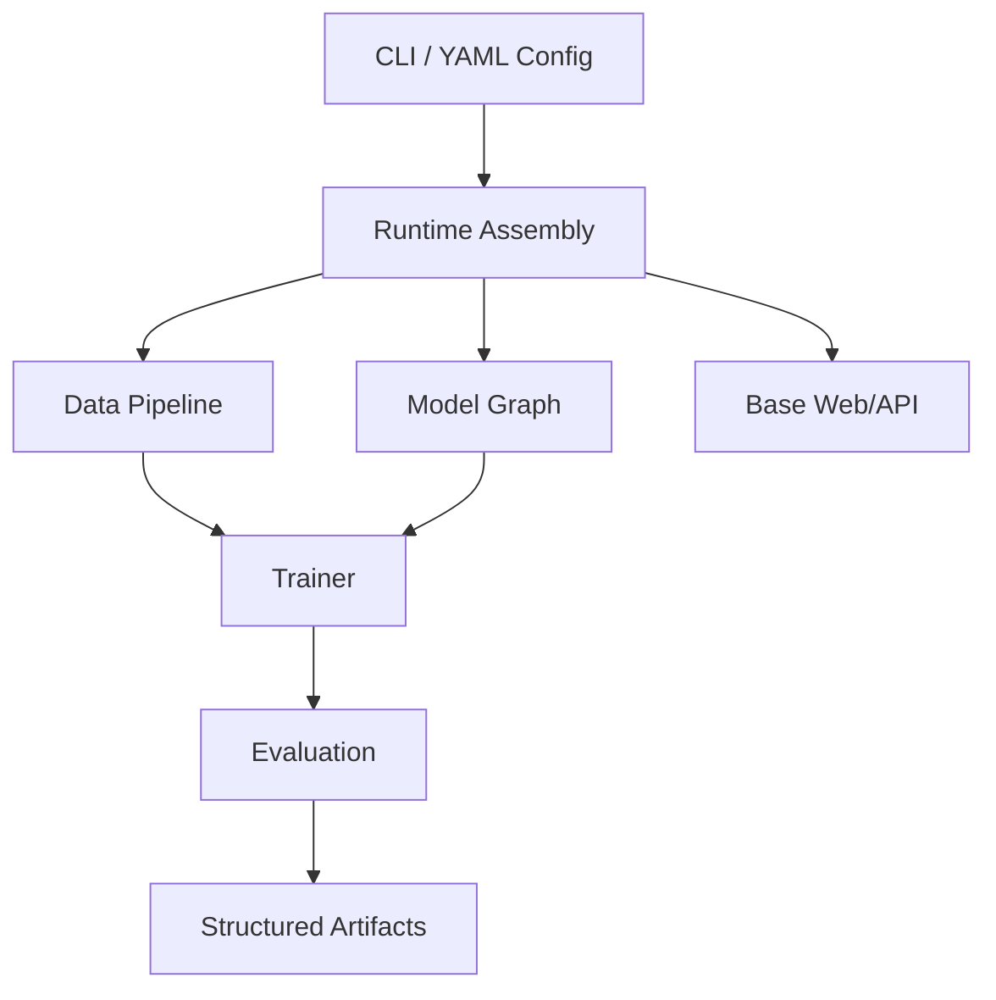

# MedFusion OSS

[](https://www.python.org/downloads/)
[](LICENSE)

**Open-core medical AI runtime for training, validation, and reproducible result artifacts.**

MedFusion OSS 聚焦一件事：把医学 AI 的研究流程从“能训练”升级到“可验证、可复盘、可交付”。

> 核心定位：**executable runtime + structured validation outputs**

---

## 为什么是 MedFusion OSS

很多项目能把模型跑起来，但训练后的结果组织、验证结构和报告产物不稳定。
MedFusion OSS 优先保证主链闭环：

- 配置先校验：`validate-config`
- 训练可执行：`train`
- 结果可复盘：`build-results`

标准输出包括：
`metrics.json` / `validation.json` / `summary.json` / `report.md` + 可视化 artifacts。

---

## OSS 与 Pro 的关系

MedFusion 采用 open-core 路线：

- **OSS = upstream core runtime / workbench（像 Chromium）**
- **Pro = commercial distribution / doctor-facing workbench（像 Chrome）**

OSS 不是 demo 壳，而是长期技术主干。

---

## 快速开始

### 1) 本地数据路径

```bash
uv run medfusion validate-config --config configs/starter/quickstart.yaml
uv run medfusion train --config configs/starter/quickstart.yaml
uv run medfusion build-results \
  --config configs/starter/quickstart.yaml \
  --checkpoint outputs/quickstart/checkpoints/best.pth
```

### 2) 公共数据快速验证

```bash
uv run medfusion public-datasets list
uv run medfusion public-datasets prepare medmnist-breastmnist --overwrite
uv run medfusion train --config configs/public_datasets/breastmnist_quickstart.yaml
uv run medfusion build-results \
  --config configs/public_datasets/breastmnist_quickstart.yaml \
  --checkpoint outputs/public_datasets/breastmnist_quickstart/checkpoints/best.pth
```

---

## 预期输出（3 分钟自检）

运行完成后，你至少应该看到类似结构：

```text
outputs/<run_name>/
├── checkpoints/
│   └── best.pth
├── logs/
├── history.json
└── results/
    ├── metrics.json
    ├── validation.json
    ├── summary.json
    └── report.md
```

`summary.json` 会包含可直接复盘/汇报的结构化信息（示例）：

```json
{
  "run_name": "quickstart",
  "task": "classification",
  "primary_metric": "auc",
  "primary_metric_value": 0.87,
  "checkpoint": "outputs/quickstart/checkpoints/best.pth",
  "artifacts": ["metrics.json", "validation.json", "report.md"]
}
```

---

## Non-goals（当前不承诺）

MedFusion OSS 当前不是：

- 通用公开 benchmark 排行平台
- 临床部署/医疗器械合规软件
- 可视化拖拽式 AutoML 产品

它现在的目标很明确：**把训练与验证结果闭环做扎实，且可复盘、可对接。**

---

## 运行主链



---

## 架构概览（README 简版）



代码级架构详解见：
- [CORE_RUNTIME_ARCHITECTURE.md](docs/contents/architecture/CORE_RUNTIME_ARCHITECTURE.md)

---

## 项目结构

```text
oss/
├── med_core/      # 核心 runtime（models, trainers, evaluation, cli, web）
├── configs/       # 配置模板
├── tests/         # 测试
├── examples/      # 示例
├── scripts/       # 回归与辅助脚本
└── docs/          # 文档
```

---

## 开发与验证

```bash
# 最小回归（推荐日常）
bash scripts/full_regression.sh --quick

# 对齐 CI
bash scripts/full_regression.sh --ci

# 完整本地回归
bash scripts/full_regression.sh --full
```

---

## 文档入口

- [快速上手](docs/contents/getting-started/quickstart.md)
- [CLI & Config 工作流](docs/contents/getting-started/cli-config-workflow.md)
- [公共数据集路径](docs/contents/getting-started/public-datasets.md)
- [文档站首页](docs/README.md)
- [OSS roadmap](../docs/roadmap/oss/README.md)

---

## 贡献与许可

- 贡献指南：[CONTRIBUTING.md](CONTRIBUTING.md)
- 许可证：[MIT](LICENSE)
- Issues: https://github.com/iridyne/medfusion/issues
- Discussions: https://github.com/iridyne/medfusion/discussions
