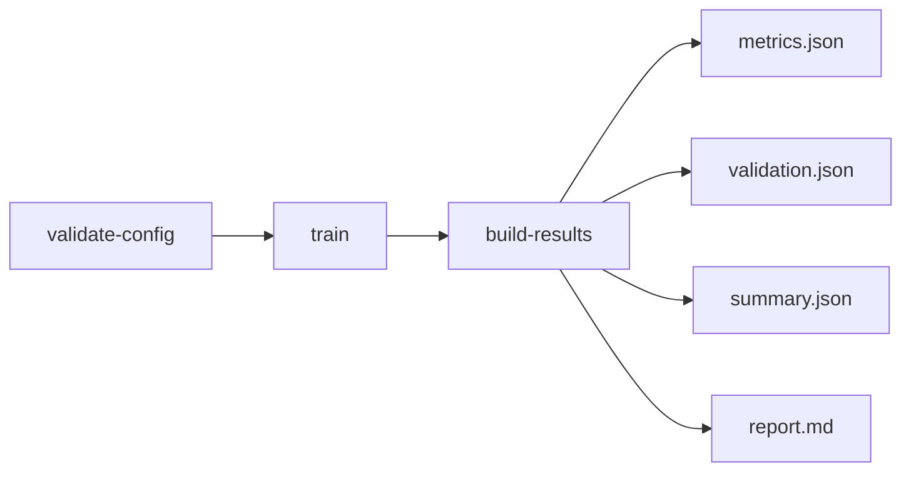

# MedFusion

[](https://www.python.org/downloads/)
[](LICENSE)

**Train medical AI models. Get real validation artifacts. Ship a result people can actually review.**

MedFusion 是一个面向医学 AI 研究验证的核心运行时。
它的核心目标不是“再做一个模型 demo”，而是把 **训练 → 结果 → validation → 报告** 这条链稳定落地。

> **MedFusion = 可执行、可复盘、可对接上层产品的医学 AI runtime。**

## 为什么团队会持续使用它

很多仓库可以把模型训起来，但训练后的结果组织、验证结构和报告输出往往不稳定。
MedFusion 当前优先保证的是三件可以长期复用的事情：

| 场景需求 | MedFusion 当前主线能力 |
| --- | --- |
| 开始前先避坑 | `validate-config` 先检查 YAML、数据列、路径和明显配置问题 |
| 训练过程真的可跑 | `train` 产出 checkpoint、logs、`history.json` |
| 结果能拿去复盘和展示 | `build-results` 生成 `metrics.json / validation.json / summary.json / report.md` 以及可视化 artifact |

## 适用人群与场景

- 医学 AI 研究生 / 课题组：想快速验证一个方向能不能跑起来
- 工程团队：想把训练、结果、报告收成统一主链
- 对外演示场景：想展示一个真实的“训练 → 结果 → 报告”闭环
- 上层产品层：需要一个可执行、可复现、可沉淀 artifact 的 runtime

## 运行主链（先检查，再训练，再产出结果）

1. **先检查输入**：确认配置、数据列、路径和 split 没明显坑
2. **再跑真实训练**：生成 checkpoint、日志和训练历史
3. **最后补齐结果**：把 run 沉淀成 validation、报告和图表 artifact



## 快速上手（两条路径）

### 1) 你已经有自己的数据

当前最稳定、最适合对外演示的主链：

```bash
uv run medfusion validate-config --config configs/starter/quickstart.yaml
uv run medfusion train --config configs/starter/quickstart.yaml
uv run medfusion build-results \
  --config configs/starter/quickstart.yaml \
  --checkpoint outputs/quickstart/checkpoints/best.pth
```

### 2) 你还没有私有数据，先快速验证

先用公开数据集入口跑通最小闭环：

```bash
uv run medfusion public-datasets list
uv run medfusion public-datasets prepare medmnist-breastmnist --overwrite
uv run medfusion train --config configs/public_datasets/breastmnist_quickstart.yaml
```

## 标准产物（可复盘、可对接）

一次标准 run 结束后，当前主链会稳定沉淀这些核心产物：

- checkpoint / logs / `history.json`
- `metrics.json`
- `validation.json`
- `summary.json`
- `report.md`
- ROC / confusion / calibration / attention 等图表 artifact

所以它当前最适合对外讲的点不是“功能很多”，而是：

> **不是只有训练命令，而是有完整结果闭环。**

## 当前稳定能力边界

- 真实训练主链：`validate-config → train → build-results → import-run`
- 结构化结果契约：`metrics.json / validation.json / summary.json / report.md`
- 公开数据集快速验证入口：`medfusion public-datasets ...`
- CLI + Web 双入口，适合研究验证和上层产品承接
- 多模态建模能力：影像 / 表格 / 时序等输入可组合
- 模块化组件：backbone / fusion / head / trainer 可替换

## 当前不承诺的范围

当前主线不是：

- 完整公开 benchmark 平台
- 已成熟的可视化拖拽建模平台
- 一个什么都做完了的医疗 AI 产品

它现在更准确的定位仍然是：

> **一个已经把训练与结果闭环做实的医学 AI 核心运行时。**

## 下一步该看哪里

- [CLI 与 Config 使用路径](docs/contents/getting-started/cli-config-workflow.md)
- [公开数据集快速验证清单](docs/contents/getting-started/public-datasets.md)
- [OSS 对外推广准备清单](docs/contents/guides/core/oss-go-to-market-checklist.md)
- [examples/README.md](examples/README.md)

## 📁 目录结构

```text
medfusion/
├── med_core/                    # 核心 Python 库
│   ├── models/                  # 模型架构（Builder, SMuRF）
│   ├── backbones/               # 骨干网络（Vision, Tabular）
│   ├── fusion/                  # 融合策略
│   ├── heads/                   # 任务头（分类、生存分析）
│   ├── aggregators/             # MIL 聚合器
│   ├── attention_supervision/   # 注意力监督
│   ├── datasets/                # 数据加载器
│   ├── trainers/                # 训练器（Multimodal, MultiView）
│   ├── evaluation/              # 评估指标和可视化
│   ├── preprocessing/           # 数据预处理
│   ├── utils/                   # 工具函数
│   ├── configs/                 # 配置验证
│   ├── web/                     # Web 服务（FastAPI）
│   └── cli/                     # 命令行接口
├── configs/                     # 配置模板
├── tests/                       # 测试套件
├── examples/                    # API / 功能演示（见 examples/README.md）
└── docs/                        # 文档
```

## 🏗️ 从代码解读的架构视图（代码架构流程图）

从代码结构看，`oss` 的职责非常明确：它是**真正执行训练、评估、预处理和结果产出的核心运行时**。

可以把它理解成一台可组合的训练引擎：CLI 和配置层负责把输入收敛成统一 runtime config，随后数据管线、模型装配、训练器、评估器和结果构建器被串成一个完整闭环。

> 一句话：**oss = executable core runtime for config → data → model → train/eval → outputs**

```mermaid
flowchart TB
  subgraph OSS["oss / Upstream Core Runtime"]
    direction TB

    subgraph CLI["CLI / Entrypoints"]
      C1["medfusion / med_core.cli.main"]
      C2["med-train"]
      C3["med-evaluate"]
      C4["med-preprocess"]
    end

    subgraph CFG["Config / Runtime Assembly"]
      R1["YAML / CLI args / defaults"]
      R2["task config parsing"]
      R3["runtime config"]
    end

    subgraph DATA["Data Pipeline"]
      D1["med_core.datasets"]
      D2["med_core.preprocessing"]
      D3["dataloaders / transforms"]
    end

    subgraph MODEL["Model Graph"]
      M1["med_core.models"]
      M2["med_core.backbones"]
      M3["med_core.fusion"]
      M4["med_core.heads"]
    end

    subgraph RUN["Training / Evaluation Runtime"]
      T1["med_core.trainers"]
      T2["loss / metrics"]
      T3["med_core.evaluation"]
      T4["output layout / result builder"]
    end

    subgraph WEB["Base Web Capability"]
      W1["med_core.web"]
    end

    C1 --> R1
    C2 --> R1
    C3 --> R1
    C4 --> R1

    R1 --> R2 --> R3
    R3 --> D1
    R3 --> D2
    R3 --> M1
    D1 --> D3
    D2 --> D3
    D3 --> T1

    M1 --> M2
    M1 --> M3
    M1 --> M4

    M2 --> T1
    M3 --> T1
    M4 --> T1

    T1 --> T2
    T1 --> T3
    T1 --> T4
    T3 --> T4
    R3 --> W1
  end
```



这个图对应的代码层含义是：

- **入口层**：`med_core.cli` 及相关命令负责接收研究配置和运行参数。
- **配置层**：把 YAML、CLI 参数和默认值收敛成统一的 runtime contract。
- **数据层**：`datasets`、`preprocessing`、dataloader/transforms 负责把原始医学数据变成训练可消费的 batch stream。
- **模型层**：`models / backbones / fusion / heads` 负责按任务装配网络图。
- **运行时层**：`trainers` 驱动训练循环，`evaluation` 负责验证和测试，结果统一落到结构化输出目录。
- **Web 层**：`med_core.web` 提供基础服务能力，供上层产品或本地界面承接。

对 `oss` 来说，最重要的不是 GUI，而是**配置是否可执行、训练链是否闭环、结果是否稳定可落盘**。这也是它作为 upstream core 的架构中心。

更细的代码级拆解见：[oss/docs/contents/architecture/CORE_RUNTIME_ARCHITECTURE.md](docs/contents/architecture/CORE_RUNTIME_ARCHITECTURE.md)。

## 🧪 验证工作流

现在仓库的统一验证入口是：

```bash
bash scripts/full_regression.sh --help
```

日常开发建议按下面顺序来：

### 1) 快速验证（推荐日常使用）

```bash
bash scripts/full_regression.sh --quick
```

这个模式是最小闭环，适合改完一小块先自检。当前会做：

- `uv sync --extra dev`
- `bash -n scripts/full_regression.sh`
- 对当前验证工作流相关 Python 文件做 `ruff check`
- 对同一批文件做 `ruff format --check`
- 运行最小测试集：
  - `tests/test_output_layout.py`
  - `tests/test_build_results.py`

### 2) 本地 CI 对齐验证

```bash
bash scripts/full_regression.sh --ci
```

这个模式尽量贴近 GitHub CI，当前会运行：

- `uv run pytest tests/ -v --cov=med_core --cov-report=xml --cov-report=term`
- `uv run pytest tests/test_end_to_end.py -v --tb=short`
- `uv run python scripts/smoke_test.py`

其中 CI 对齐模式当前**有意忽略**：

- `tests/test_config_validation.py`
- `tests/test_export.py`

这两项现在是显式约定，不再靠口头记忆。

### 3) 更完整的本地回归

```bash
bash scripts/full_regression.sh --full
```

这个模式会调用当前更重的本地检查入口：

- `bash scripts/local_ci_test.sh`

如果你只是日常开发，先跑 `--quick` 就够了。准备提交较大改动时，再跑 `--ci` 或 `--full`。

## 📊 多 seed 稳定性评估

这个能力现在已经进入主线能力层，不是 demo 私有脚本。

适用场景：

- 日常开发完成后，准备做“定版检查”
- 想确认某个配置不是碰巧被单次 seed 跑出来
- 需要对外汇报 mean / std 稳定性

当前 `smurf_e2e` 的触发方式是显式进入 `stability` 子命令：

```bash
# 读取配置中的 stability.seeds
bash demo/smurf_e2e/run_single_ct.sh stable stability

# 临时覆盖 seed 列表
SEEDS=13,21,34 bash demo/smurf_e2e/run_single_ct.sh stable stability

# 直接调用 Python 入口
uv run python demo/smurf_e2e/smurf_e2e.py \
  --config demo/smurf_e2e/config.elbow_single_ct_stable.yaml \
  stability --seeds 11,22,42
```

输出结构：

```text
<study_root>/
├── seeds/
│   ├── seed-0011/
│   ├── seed-0022/
│   └── seed-0042/
└── stability/
    ├── summary.json
    ├── summary.csv
    └── summary.md
```

其中：

- `seeds/seed-XXXX/`：每个 seed 的独立 train/evaluate/report 结果
- `stability/summary.json`：完整聚合结果
- `stability/summary.csv`：方便表格处理
- `stability/summary.md`：方便直接阅读

## 🔧 开发

### 常用测试命令

```bash
# 运行所有测试
uv run pytest

# 运行特定测试文件
uv run pytest tests/test_models.py

# 运行特定测试函数
uv run pytest tests/test_models.py::test_model_builder

# 运行匹配模式的测试
uv run pytest -k "fusion"

# 生成覆盖率报告
uv run pytest --cov=med_core --cov-report=html

# 查看详细输出
uv run pytest -v
```

### 代码质量检查

```bash
# 代码检查
uv run ruff check med_core/

# 自动修复问题
uv run ruff check med_core/ --fix

# 代码格式化
uv run ruff format med_core/

# 类型检查
uv run mypy med_core/
```

### 项目要求

- Python 3.11+
- PyTorch 2.0+
- 使用现代类型注解（PEP 585/604）
- 所有函数必须有完整的类型注解
- 遵循 88 字符行长度限制

详细开发指南请参考 [CLAUDE.md](CLAUDE.md)。

## ⚡ 性能优化

### 优化优先级

遇到性能问题时，按以下顺序优化：

1. **算法层面**：混合精度训练、梯度累积、模型剪枝/量化
2. **工程层面**：数据缓存、预计算特征、优化 DataLoader
3. **基础设施**：更好的 GPU、分布式训练、NVMe SSD
4. **部署优化**：TorchScript、ONNX、TensorRT
5. **自定义算核**：Triton CUDA kernel、C++ 扩展

### 常见瓶颈解决方案

- **数据加载慢**：增加 `num_workers`、使用数据缓存、更快的存储
- **GPU 利用率低**：增大 batch size、优化 DataLoader、检查 CPU 预处理
- **显存不足**：梯度累积、混合精度、减小 batch size
- **训练时间长**：分布式训练、更好的 GPU、优化模型架构

**注意**：不建议过早迁移到 Rust。PyTorch 核心已经是 C++/CUDA 优化的，大部分性能瓶颈在 I/O 和 GPU 利用率，而非 Python 开销。详见 [CLAUDE.md](CLAUDE.md) 的性能优化章节。

## 🤝 贡献

欢迎贡献！请查看 [贡献指南](CONTRIBUTING.md)。

## 📄 许可证

本项目采用 MIT 许可证 - 详见 [LICENSE](LICENSE) 文件。

## 📮 联系方式

- 问题反馈: [GitHub Issues](https://github.com/iridyne/medfusion/issues)
- 使用讨论: [GitHub Discussions](https://github.com/iridyne/medfusion/discussions)

## 🙏 致谢

感谢所有贡献者和开源社区的支持。
