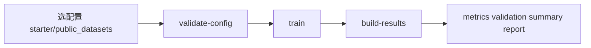

# MedFusion 文档

这套文档服务于 MedFusion OSS：一个面向医学 AI 训练与验证的 open-core runtime。

如果你是第一次来，先不要全看，按你的目标选一条路径就行。

文档状态说明：
- **Stable**：接口和流程相对稳定，推荐优先参考
- **Beta**：仍在迭代，可能随版本调整
- **Legacy**：仅历史参考，不建议新项目按此落地

---

## 高频入口（90% 场景）

- [Web UI 快速入门](contents/getting-started/web-ui.md)
- [如何新建模型与 YAML](contents/getting-started/model-creation-paths.md)
- [CLI 与 Config 使用路径](contents/getting-started/cli-config-workflow.md)
- [快速上手](contents/getting-started/quickstart.md)
- [公开数据集快速验证](contents/getting-started/public-datasets.md)
- [任务手册（按目标执行）](contents/playbooks/README.md)
- [FAQ 和故障排除](contents/guides/core/faq.md)

## 新手 60 秒决策

如果你只想知道“我现在该点哪篇文档”，按这个来：

- **第一次进入仓库** → 先看 [Web UI 快速入门](contents/getting-started/web-ui.md)
- **没有私有数据** → 先看 [公开数据集快速验证](contents/getting-started/public-datasets.md)
- **有私有数据，想先跑通** → 先看 [CLI 与 Config 使用路径](contents/getting-started/cli-config-workflow.md)
- **想自己新建 YAML / 模型** → 先看 [如何新建模型与 YAML](contents/getting-started/model-creation-paths.md)
- **想理解架构再上手** → 先看 [Core Runtime Architecture](contents/architecture/CORE_RUNTIME_ARCHITECTURE.md)
- **要改代码/做贡献** → 先看 [安装](contents/getting-started/installation.md) + [教程总览](contents/tutorials/README.md)

第一次使用更推荐先跑：

```bash
uv run medfusion start
```

它会先把你带到 `Getting Started` 和 `Quickstart Run`，帮助你理解推荐 quickstart、主链阶段和预期产物。

然后再回到这条最短 YAML 主链：

```bash
uv run medfusion validate-config --config configs/starter/quickstart.yaml
uv run medfusion train --config configs/starter/quickstart.yaml
uv run medfusion build-results --config configs/starter/quickstart.yaml --checkpoint outputs/quickstart/checkpoints/best.pth
```

---

## 一图看懂主链



> 想看更详细的用户流程图：
> [CLI 与 Config 使用路径](contents/getting-started/cli-config-workflow.md)

---

## 从这里开始（3 条路径）

### 1) 我想先把主链跑通（推荐）

- [Web UI 快速入门](contents/getting-started/web-ui.md)
- [如何新建模型与 YAML](contents/getting-started/model-creation-paths.md)
- [CLI 与 Config 使用路径](contents/getting-started/cli-config-workflow.md)
- [快速上手](contents/getting-started/quickstart.md)
- [公开数据集快速验证](contents/getting-started/public-datasets.md)

适合：新用户、对外 demo、先要结果再深入。

补一句关键边界：

- 普通用户：复制主链模板
- 高级用户：Builder / 代码做结构实验
- 真正新的模型能力：先扩 runtime，再扩 YAML

### 任务手册（按目标执行）

- [Playbooks 总入口](contents/playbooks/README.md)
- [最小可复现实验（MRE）](contents/playbooks/minimum-reproducible-run.md)
- [正式版 Smoke Matrix](contents/playbooks/release-smoke-matrix.md)
- [对外 Demo 路径](contents/playbooks/external-demo-path.md)
- [多 seed 稳定性汇报](contents/playbooks/multi-seed-stability-report.md)
- [结果解读与交付检查](contents/playbooks/result-interpretation-checklist.md)

### 2) 我想理解系统怎么工作的

- [Core Runtime Architecture](contents/architecture/CORE_RUNTIME_ARCHITECTURE.md)
- [Workflow 设计](contents/architecture/WORKFLOW_DESIGN.md)
- [Web UI 架构](contents/architecture/WEB_UI_ARCHITECTURE.md)

适合：架构评审、技术选型、二次开发前调研。

### 3) 我要做开发或贡献

- [安装](contents/getting-started/installation.md)
- [教程总览](contents/tutorials/README.md)
- [贡献指南](../CONTRIBUTING.md)

适合：准备改代码、补测试、提交 PR。

## 本地预览文档

如果你要在本机预览 VitePress 文档，进入 `docs/` 目录后执行：

```bash
npm install
npm run docs:dev
```

构建静态站点：

```bash
npm run docs:build
npm run docs:preview
```

说明：
- `docs/node_modules/`、`docs/.vitepress/dist/`、`docs/.vitepress/cache/` 都是本地产物，不属于文档源码
- 如果这些目录缺失，重新执行 `npm install` 或 `npm run docs:build` 即可恢复

---

## 深入文档入口

- API 参考：
  - [med_core](contents/api/med_core.md)
  - [models](contents/api/models.md)
  - [backbones](contents/api/backbones.md)
  - [fusion](contents/api/fusion.md)
  - [heads](contents/api/heads.md)
  - [datasets](contents/api/datasets.md)
  - [trainers](contents/api/trainers.md)
  - [preprocessing](contents/api/preprocessing.md)
  - [evaluation](contents/api/evaluation.md)
  - [web_api](contents/api/web_api.md)

- 核心指南：
  - [Why MedFusion OSS（定位对比）](contents/guides/core/why-medfusion-oss.md)
  - [文档写作与一致性规范](contents/guides/development/docs-style-guide.md)

- 参考：
  - [错误代码](contents/reference/error_codes.md)

---

## 文档使用建议

- 第一次使用先 `medfusion start`，再回到 YAML 主线真正执行。
- 先走“主链跑通”，再看架构和 API。
- 如果你要判断是否接入，优先看输出契约：`metrics/metrics.json / metrics/validation.json / reports/summary.json / reports/report.md`。
- 如果链接失效或内容过期，欢迎直接提 Issue 或 PR。
