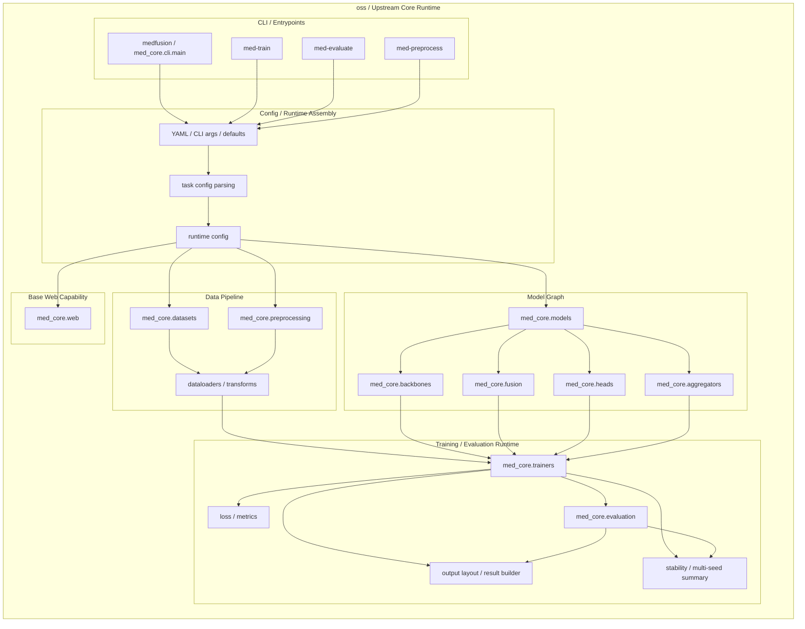
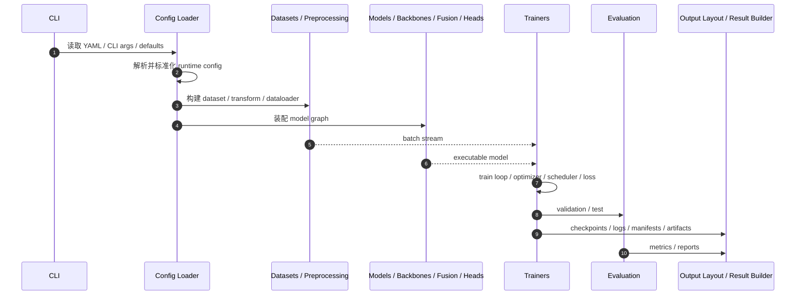

# MedFusion Core Runtime Architecture

**版本**: v1.0  
**日期**: 2026-03-25  
**状态**: Active

## 背景

`oss` 仓库的核心职责不是做一个产品化工作台，而是提供一个**可执行、可组合、可回归**的医学多模态训练运行时。

从代码上看，它更像一台分层清晰的训练引擎：

- 入口层负责接收命令和配置
- 配置层负责把输入收敛成统一运行契约
- 数据层负责把原始样本转成训练批次
- 模型层负责装配 backbone / fusion / head
- 运行时层负责训练、评估、产物落盘
- Web 层负责提供基础服务能力给上层界面承接

> 一句话：**oss = executable core runtime for config → data → model → train/eval → outputs**

---

## 1. 总体架构图

这个图反映的是一个很稳定的架构判断：`oss` 的真正中心是 **runtime contract**，不是某个单一模型类，也不是某个单一 GUI 页面。

也就是说，配置一旦被解析成统一 runtime config，后面的数据、模型、训练和结果链路就都围绕这个契约展开。

---

## 2. 目录到职责的映射

### 2.1 入口与命令层

主要入口在：

- `med_core/cli/`
- 包装后的命令入口：`medfusion`、`med-train`、`med-evaluate`、`med-preprocess`

这一层负责：

- 接收用户命令
- 读取 YAML 或 CLI 参数
- 选择训练 / 评估 / 预处理路径
- 将输入转交给统一的配置和运行时装配逻辑

它的作用很像“前台接待台”：不直接训练模型，但决定任务如何进入系统。

### 2.2 配置与运行契约层

相关模块主要散落在：

- `med_core/configs/`
- CLI 参数解析逻辑
- 训练 / 评估 / 预处理的任务配置装配逻辑

这一层最重要的事情，是把：

- YAML
- CLI args
- 默认值
- 环境约定

收敛成一个**统一、可执行、可验证**的 runtime config。

这层很关键，因为 `oss` 的模块化不是靠“大家互相猜参数”，而是靠共享同一份运行契约。

### 2.3 数据层

相关目录主要是：

- `med_core/datasets/`
- `med_core/preprocessing/`

这一层负责把原始医学数据变成训练能消费的 batch stream，包括：

- 数据集定义
- 样本读取
- 预处理
- 变换与增强
- dataloader 装配

从运行时角度看，这一层解决的是“原料如何变成可喂给模型的标准输入”。

### 2.4 模型装配层

相关目录主要是：

- `med_core/models/`
- `med_core/backbones/`
- `med_core/fusion/`
- `med_core/heads/`
- `med_core/aggregators/`
- `med_core/attention_supervision/`

这里不是简单放一堆模型文件，而是在做**图装配**：

- backbone 提取模态特征
- fusion 组合多模态表示
- head 完成任务输出
- aggregator 处理 MIL / 多实例聚合
- attention supervision 提供额外监督路径

所以 `oss` 里的“模型”不是单块黑盒，而是按职责拆开的组合系统。

### 2.5 训练、评估与结果层

相关目录主要是：

- `med_core/trainers/`
- `med_core/evaluation/`
- `med_core/output_layout.py`
- `med_core/stability.py`

这一层负责真正把实验跑起来并沉淀产物：

- 训练循环
- loss / metrics
- 验证与测试
- checkpoint / report / manifest / artifact 输出
- 多 seed 稳定性汇总

这也是 `oss` 工程价值最高的一层之一，因为研究框架最怕“能跑但不可复现”，而这里做的是把结果变成结构化、可回查、可比较的输出。

### 2.6 基础 Web 能力层

相关目录主要是：

- `med_core/web/`

这一层不是完整产品，而是提供基础服务能力，比如：

- API
- 状态暴露
- 训练过程观察接口
- 给上层界面复用的基础后端能力

它是承接层，不是产品定义层。

---

## 3. 运行主链：从配置到训练结果

下面这张图更接近真实执行顺序。

这条链路说明一个事情：

`oss` 的核心不是“某个 trainer 很强”，而是**从输入配置到结果产物的全链路闭环很完整**。

对研究框架来说，完整闭环比单点能力更重要，因为：

- 没有统一配置，实验不可复现
- 没有统一输出，结果不可比较
- 没有稳定评估，结论不可依赖

---

## 4. 代码层的组织原则

### 4.1 模块化不是目录好看，而是替换边界清晰

`oss` 的模块拆分本质上是在定义替换边界：

- 想换 backbone，不该改 trainer
- 想换 fusion，不该改 dataset
- 想换 head，不该重写整条训练链

这意味着仓库结构本身就在表达一种工程承诺：**不同研究假设应该尽量在局部替换，而不是牵一发而动全身**。

### 4.2 运行契约优先于页面交互

`oss` 先有 CLI、配置和输出契约，再考虑 Web 或其他承接界面。

这个顺序很重要，因为上层 UI 可以换，但：

- runtime config 不能乱
- output layout 不能乱
- evaluation contract 不能乱

只要这几个契约稳定，`oss` 就能被 CLI、Web、脚本、上层产品层共同复用。

### 4.3 结果结构化是架构的一部分

`med_core.output_layout` 和相关测试的存在，说明输出目录并不是“顺手写文件”的副产品，而是架构里的正式组成部分。

也就是说，checkpoint、report、manifest、artifact 的组织方式，本身就是运行时设计的一部分。

### 4.4 多 seed 稳定性已经进入主线能力

`med_core.stability` 和相关结果汇总逻辑说明，多 seed 不是 demo 私货，而是逐步进入核心能力层。

这意味着 `oss` 不只关心“能不能跑出一次结果”，还关心：

- 多次实验是否稳定
- mean / std 是否可汇报
- 输出是否适合回归和比较

---

## 5. 与 Pro 产品层的边界

从架构边界看：

- `oss` 负责 **执行**
- `pro` 负责 **编排与产品化承接**

更准确一点：

- `oss` 解决“配置怎样真正跑起来”
- `pro` 解决“用户怎样不碰 CLI 也能得到这份配置”

所以 `oss` 的目标不是隐藏复杂度，而是把复杂度组织成可复用的执行契约。

这也是为什么 `pro` 可以建立在 `oss` 之上：因为 `oss` 已经把运行时边界划得足够清楚。

---

## 6. 面向贡献者的阅读顺序

如果你是第一次读 `oss` 代码，建议按下面顺序看：

1. `README.md`
   - 先建立对仓库职责的整体认识
2. `docs/contents/getting-started/cli-config-workflow.md`
   - 先搞清楚哪些配置给 CLI，哪些只是 builder 示例
3. `med_core/cli/`
   - 看任务从哪里进来
4. `med_core/datasets/` + `med_core/preprocessing/`
   - 看输入如何变成 batch
5. `med_core/models/` + `backbones/` + `fusion/` + `heads/`
   - 看模型如何装配
6. `med_core/trainers/` + `med_core/evaluation/`
   - 看训练与验证如何闭环
7. `med_core/output_layout.py` + `med_core/stability.py`
   - 看结果如何结构化和聚合
8. `med_core/web/`
   - 最后再看基础服务承接能力

这个阅读顺序会比从某个模型文件一头扎进去更容易建立整体感。

---

## 7. 总结

从代码角度看，`oss` 的架构可以浓缩成三句话：

1. 它首先是一个**配置驱动的核心运行时**。
2. 它的价值在于把数据、模型、训练、评估和结果组织成**可复用闭环**。
3. 它为上层 Web 或 Pro 产品层提供的是**稳定执行契约**，而不是耦合在一起的单体应用。

如果要用最短的话来概括：

> `oss` 不是一个“带几个模型的仓库”，而是一套能把医学多模态实验稳定跑完、评估完、产物沉淀下来的核心执行系统。
