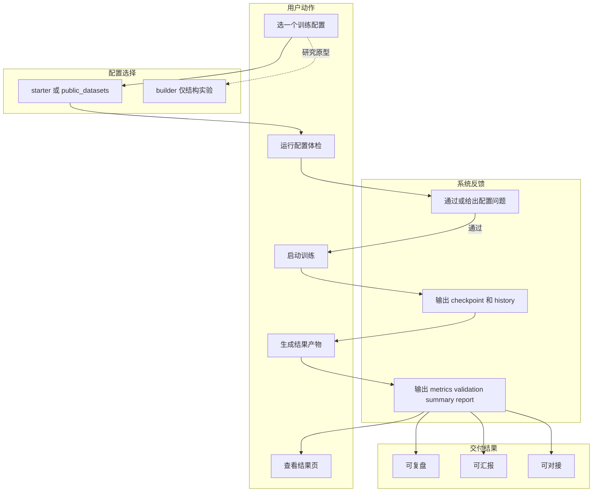

# CLI 与 Config 使用路径

> 文档状态：**Stable**

这个项目现在有三条不同层级的使用路径。如果不先讲清楚，很容易出现“看起来有 CLI，但又不知道该喂哪个 YAML”的问题。

## 一、最稳定的主链

这是当前最适合新用户和对外演示的路径。
如果你还没有自己的数据，先去 [公开数据集快速验证清单](public-datasets.md)。

```bash
uv run medfusion validate-config --config configs/starter/quickstart.yaml
uv run medfusion train --config configs/starter/quickstart.yaml
uv run medfusion build-results \
  --config configs/starter/quickstart.yaml \
  --checkpoint outputs/quickstart/checkpoints/best.pth
```

这条链使用的是当前 dataclass 驱动的训练配置，适合：

- 跑 mock 数据
- 跑公开数据集 quick validation
- 接 Web UI / artifact / validation / 报告

其中三个命令分别解决三件事：

- `validate-config`
  - 在训练前检查 YAML、CSV 列、图像路径、样本规模和 split 是否明显有坑
- `train`
  - 真正产出 checkpoint 和 TensorBoard 日志
- `build-results`
  - 把 checkpoint 补成结果页可直接消费的 `metrics.json / validation.json / ROC / confusion / attention / report`

对应配置目录：

- `configs/starter/`
- `configs/public_datasets/`
- `configs/testing/`

## 用户视角流程图（主链）

下面这张图只保留“用户如何使用框架”的关键路径，方便第一次接触时快速建立心智模型。



> 小提示：第一次使用建议只走 `starter/public_datasets -> validate-config -> train -> build-results` 这条主链，先把闭环跑通，再进入 builder 结构实验。

## 二、Builder / 结构实验链

这条链更适合研究型模型拼装，不是当前 CLI 训练主链的同一种配置 schema。

典型入口：

- `MultiModalModelBuilder`
- `build_model_from_config()`

对应配置目录：

- `configs/builder/`

这类 YAML 更接近“描述模型结构”，不一定能直接丢给：

```bash
medfusion train --config ...
```

所以如果你只是想先跑通训练和结果页，不要从 `configs/builder/` 开始。

## 三、Web UI 链

Web UI 面向演示型 MVP，主打：

1. 数据集登记
2. 发起训练
3. 看训练过程
4. 看结果 artifact / validation / 报告

启动方式：

```bash
uv run medfusion start
```

这里的 `start` 是现在推荐的新入口：

- 直接进入工作台首页
- 首页会把“快速演示训练 / 导入真实训练结果 / 数据准备”三条常用路径收口到一起
- `medfusion web` 仍然保留，但更适合作为兼容入口或高级入口理解

## 当前推荐顺序

### 新用户

1. `configs/starter/quickstart.yaml`
2. 先跑 `medfusion validate-config`
3. 再跑 `medfusion train`
4. 训练完再跑 `medfusion build-results`
5. 最后用 `medfusion start` 进入工作台或结果页

### 做研究原型的人

1. `MultiModalModelBuilder`
2. `configs/builder/`
3. 自己决定是否回接到训练主链

## 一句话判断该用哪类 YAML

- 想直接训练：看 `configs/starter/`、`configs/public_datasets/`、`configs/testing/`
- 想表达模型结构：看 `configs/builder/`
- 想翻旧模板：看 `configs/legacy/`
