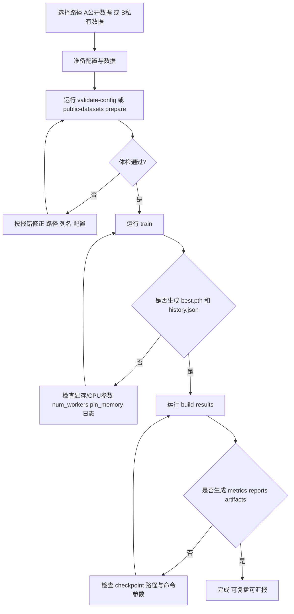

# MedFusion 新手避坑指南

> 文档状态：**Stable**

这页只做一件事：帮你用最短路径跑通 MedFusion 主链，并快速判断“是否真的成功”。

## 先看这两页

- [CLI 与 Config 使用路径](cli-config-workflow.md)
- [公开数据集快速验证清单](public-datasets.md)（还没有私有数据时优先看）

---

## 最短可跑路径

### A) 没有私有数据（推荐先走）

```bash
uv run medfusion public-datasets list
uv run medfusion public-datasets prepare medmnist-breastmnist --overwrite
uv run medfusion train --config configs/public_datasets/breastmnist_quickstart.yaml
uv run medfusion build-results \
  --config configs/public_datasets/breastmnist_quickstart.yaml \
  --checkpoint outputs/public_datasets/breastmnist_quickstart/checkpoints/best.pth
```

### B) 已有私有数据

```bash
uv run medfusion validate-config --config configs/starter/quickstart.yaml
uv run medfusion train --config configs/starter/quickstart.yaml
uv run medfusion build-results \
  --config configs/starter/quickstart.yaml \
  --checkpoint outputs/quickstart/checkpoints/best.pth
```

---

## 一图看懂（新手主链 + 常见失败分支）



> 你可以把这张图理解成“先体检、再训练、再产物”的三段式。不要跳过中间任何一步。

## ✅ 预期输出（跑通标准）

至少应该看到：

- `outputs/<run_name>/checkpoints/best.pth`
- `outputs/<run_name>/logs/history.json`
- `outputs/<run_name>/metrics/metrics.json`
- `outputs/<run_name>/metrics/validation.json`
- `outputs/<run_name>/reports/summary.json`
- `outputs/<run_name>/reports/report.md`
- `outputs/<run_name>/artifacts/`

如果只看到了 checkpoint，但没有 `metrics/`、`reports/` 或 `artifacts/`，通常是：
- 还没执行 `build-results`
- `--checkpoint` 路径传错

---

## 多 seed 稳定性（进阶）

如果单次训练已经稳定，可进一步做多 seed 聚合。

当前主线 CLI 没有单独的 `stability` 子命令，建议使用共享的
`med_core.stability.run_stability_study` 来批量调用
`medfusion train` 和 `medfusion build-results`。

完整示例见：
- [多 seed 稳定性汇报](../playbooks/multi-seed-stability-report.md)

产物：
- `seeds/seed-XXXX/`（每个 seed 独立结果）
- `stability/summary.json`
- `stability/summary.csv`
- `stability/summary.md`

## 高频问题（先看这 6 条）

1. **`Unknown fusion type: concat`**
   - 配置文件里用 `concatenate`，不要用 `concat`

2. **`FileNotFoundError: data/dataset.csv`**
   - 优先从 `configs/starter/quickstart.yaml` 起步
   - 先确认 `csv_path` / `image_dir` 是真实路径

3. **`KeyError: <column>`**
   - 配置里的 `numerical_features` / `categorical_features` 必须与 CSV 列名一致

4. **CPU 环境 `pin_memory` 警告**
   - CPU 下把 `pin_memory: false`

5. **`val_auc = 0.0000`**
   - 常见原因是验证集太小，先增大样本或改看 accuracy/F1

6. **`DataLoader worker killed`**
   - 调试阶段设 `num_workers: 0`

---

## 配置边界（最容易混淆）

- `configs/starter/`、`configs/public_datasets/`、`configs/testing/`：CLI 训练主链
- `configs/builder/`：Builder 结构示例（不等价 CLI 训练配置）
- `configs/legacy/`：历史模板，不建议新项目起步
- `examples/`：API/专题演示，不是首选训练入口
- 示例边界说明见：`examples/README.md`

---

## 下一步推荐

- [任务手册（按目标执行）](../playbooks/README.md)
- [FAQ 和故障排除](../guides/core/faq.md)
- [开发与贡献指南](../guides/development/contributing.md)
- [Core Runtime Architecture](../architecture/CORE_RUNTIME_ARCHITECTURE.md)
- [Developer Examples Guide](../../../../examples/README.md)

## 获取帮助

提 Issue 时建议附上：
- 完整报错
- 配置文件
- 数据规模（样本数/特征数）
- 环境信息（Python / PyTorch / CUDA）
