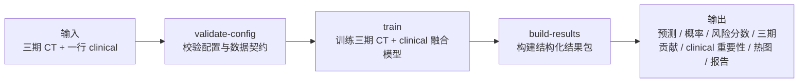
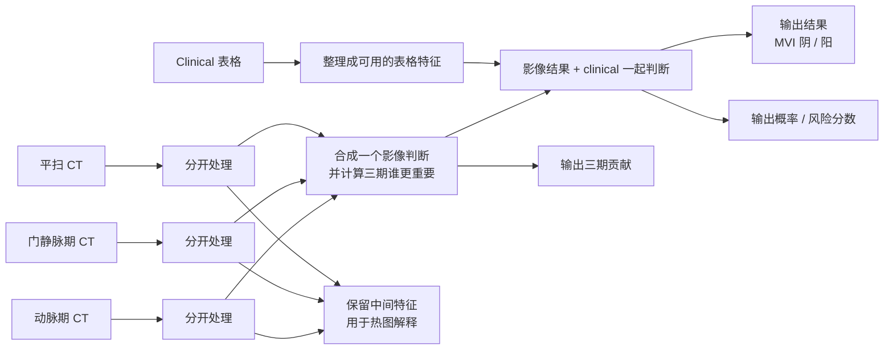
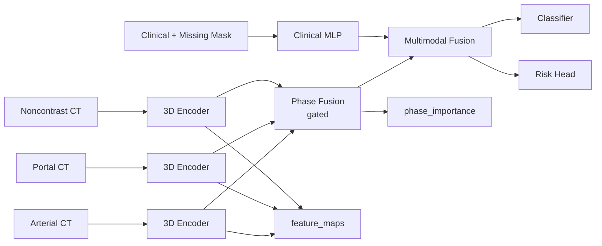

# 三期 CT + Clinical -> MVI Demo 复盘

基于 `configs/demo/three_phase_ct_mvi_dr_z.yaml` 与主线代码路径  
用于预实验推进汇报 / demo 演示 / 收数要求说明的技术底稿

- 核心流程 1：上一个 demo 做了什么
- 核心流程 2：这个 demo 是如何做的
- 核心流程 3：现在结果怎样

---

# 汇报骨架

- 第一部分：上一个 demo 做了什么
- 第二部分：这个 demo 是如何做的
- 第三部分：现在结果怎样
- 附页只保留两类：真实结果替换位、下一步收数要求

---

# 先讲边界

- 这套内容讲的是 `PoC / demo`，不是临床成品，也不是临床验证结论。
- 复盘依据来自主线代码、配置、结果构建逻辑，以及一次本地 sanity run。
- 代码能证明的是“流程和结果包已跑通”；真实 cohort 数、真实指标、真实截图要替换成你们本次 run。
- 仓库里没有 `.private/demo/dr_z_mvi_cases.csv`，所以 `10 例 / 204 排除` 这类业务口径不能直接从公开代码仓验证。

---
layout: center
class: text-center
---

# 第一部分
## 上一个 Demo 做了什么

---

# 第一部分：任务收口

- 任务类型：`术前三期 CT + clinical -> MVI 二分类预测`
- 主线配置：`configs/demo/three_phase_ct_mvi_dr_z.yaml`
- 输入单位：单病例
- 输入模态：`arterial`、`portal`、`noncontrast` 三期 CT + clinical 表格
- 标签：`mvi_binary`
- 当前主线 cohort：`10` 例完整 three-phase CT
- 病例号：`203, 208, 209, 210, 212, 215, 216, 217, 218, 220`
- `204` 因为是 `MR-only`，未进入当前 CT 主线
- 当前 demo 不是多任务平台展示，也不是临床可直接使用的正式评分系统

---

# 第一部分：输入与输出

- 输入：
- 一个 `manifest CSV`
- 每行至少要有：`case_id`、三期 DICOM 目录、`mvi_binary`
- demo config 当前挂了 `17` 个 clinical 字段
- 输出：
- 分类结果、概率、风险分数
- 三期贡献、clinical 重要性、热图解释
- `summary.json` / `validation.json` / `report.md`

---

# 第一部分：现场展示路径



## 现场建议只讲 4 件事

- 输入是什么
- 模型做了什么
- 输出了什么
- 现在能展示到什么程度

---
layout: center
class: text-center
---

# 第二部分
## 这个 Demo 是如何做的

---

# 第二部分：数据如何进入模型

- 数据集实现：`med_core/datasets/three_phase_ct.py`
- 每个样本会读取 `arterial`、`portal`、`noncontrast`、`clinical`、`label`
- CT 预处理主线：DICOM 读取、`liver` window、slice 排序、重采样到统一 `target_shape`
- 当前 demo 的目标体素尺寸：`[16, 64, 64]`
- clinical 预处理：`normalize: true`
- 缺失策略：`zero_with_mask`
- 也就是“数值”和“缺失标记”一起进入模型

---

# 第二部分：模型结构（简版）



- 三期 CT 是先分开看的，不是直接混成一张图。
- 模型先形成一个“影像侧判断”，再和 clinical 表格一起做最终判断。
- 最后不只输出阴阳结果，还能补充概率、三期贡献和热图解释。

---

# 第二部分：模型结构（技术版）



---

# 第二部分：工程如何跑通

```bash
uv run medfusion validate-config --config configs/demo/three_phase_ct_mvi_dr_z.yaml
uv run medfusion train --config configs/demo/three_phase_ct_mvi_dr_z.yaml
uv run medfusion build-results \
  --config configs/demo/three_phase_ct_mvi_dr_z.yaml \
  --checkpoint outputs/three_phase_ct_mvi_dr_z/checkpoints/best.pth
```

- `validate-config`：校验配置和数据契约
- `train`：训练三期 CT + clinical 融合模型
- `build-results`：构建结构化结果包
- 代码里实际保留的关键中间结果：`probability`、`risk_score`、`phase_importance`、`feature_maps`

---
layout: center
class: text-center
---

# 第三部分
## 现在结果怎样

---

# 第三部分：推荐展示版结果快照

- 输出目录：`outputs/three_phase_ct_mvi_dr_z_presentation_all`
- 展示版配置：`.private/demo/three_phase_ct_mvi_dr_z_presentation.yaml`
- 本次 `build-results` split：`all`
- 评估样本数：`10`
- 标签分布：`7 阳性 / 3 阴性`
- 主指标：`accuracy = 0.3`
- `AUC = 0.1429`
- `ROC` 已正常生成
- 三期平均贡献：
- `arterial = 0.315859`
- `portal = 0.342557`
- `noncontrast = 0.341584`
- 关键 clinical 因素前五：
- `max_tumor_diameter`
- `child_stage`
- `sex`
- `glucose`
- `bmi`
- 已生成：`summary.json`、`validation.json`、`report.md`、`ROC`、`confusion matrix`、`heatmaps`、`clinical importance`
- 这版用于汇报展示，不应用来表述成严格独立测试集结论

---

# 第三部分：当前能展示什么

- 第一层：输入
- 一例病例的三期 CT
- 一行 clinical 数据
- 第二层：输出
- `predicted_label`
- `pred_probability`
- `risk_score`
- `phase_importance`
- `top_clinical_factors`
- 第三层：结果包
- `summary.json`
- `report.md`
- `validation.json`
- `ROC / confusion matrix`
- `heatmaps manifest`

---

# 第三部分：关键图件 1

<div style="display:flex; gap:16px; align-items:flex-start;">
  <div style="flex:1;">
    <div style="font-weight:600; margin-bottom:8px;">ROC</div>
    
  </div>
  <div style="flex:1;">
    <div style="font-weight:600; margin-bottom:8px;">Confusion Matrix</div>
    
  </div>
</div>

- 这页主要回答两个问题：
- 有没有基本的区分能力曲线
- 当前错分主要发生在哪一类

---

# 第三部分：关键图件 2

<div style="display:flex; gap:16px; align-items:flex-start;">
  <div style="flex:1.15;">
    <div style="font-weight:600; margin-bottom:8px;">Clinical Importance</div>
    
  </div>
  <div style="flex:0.85;">
    <div style="font-weight:600; margin-bottom:8px;">Phase Contribution</div>
    <table style="width:100%; border-collapse:collapse; font-size:16px;">
      <thead>
        <tr>
          <th style="text-align:left; padding:8px; border-bottom:1px solid #ccc;">Phase</th>
          <th style="text-align:right; padding:8px; border-bottom:1px solid #ccc;">Mean Importance</th>
        </tr>
      </thead>
      <tbody>
        <tr>
          <td style="padding:8px; border-bottom:1px solid #eee;">arterial</td>
          <td style="padding:8px; text-align:right; border-bottom:1px solid #eee;">0.315859</td>
        </tr>
        <tr>
          <td style="padding:8px; border-bottom:1px solid #eee;">portal</td>
          <td style="padding:8px; text-align:right; border-bottom:1px solid #eee;">0.342557</td>
        </tr>
        <tr>
          <td style="padding:8px; border-bottom:1px solid #eee;">noncontrast</td>
          <td style="padding:8px; text-align:right; border-bottom:1px solid #eee;">0.341584</td>
        </tr>
      </tbody>
    </table>
    <div style="margin-top:14px; font-size:15px; line-height:1.5;">
      Top 5 clinical factors:
      <br />1. max_tumor_diameter
      <br />2. child_stage
      <br />3. sex
      <br />4. glucose
      <br />5. bmi
    </div>
  </div>
</div>

- 这页主要回答：
- 影像三期里谁更重要
- clinical 侧哪些变量对当前结果包影响更大

---

# 第三部分：标准结果包长什么样

```text
outputs/<run_name>/
├── checkpoints/
│   └── best.pth
├── logs/
│   └── history.json
├── metrics/
│   ├── metrics.json
│   ├── validation.json
│   ├── predictions.json
│   ├── phase_importance.json
│   └── case_explanations.json
├── reports/
│   ├── summary.json
│   └── report.md
└── artifacts/
    ├── training-config.json
    ├── shap_summary.json
    └── visualizations/
        ├── roc_curve.png
        ├── confusion_matrix.png
        ├── shap/
        └── heatmaps/
```

---

# 第三部分：几个关键结果文件分别讲什么

- `summary.json`
- 讲 run 级结论：这次任务是什么、主指标是什么、结果文件在哪里
- `validation.json`
- 讲逐例结果：每个病例预测成什么、概率多少、三期贡献怎样
- `report.md`
- 讲可读交付：把关键结论和图件组织成一页报告
- `phase_importance.json`
- 讲三期谁更重要
- `case_explanations.json`
- 讲病例级解释与热图挂接关系

---

# 第三部分：现场最值得展示的 6 个结果位

- `summary.json`
- `report.md`
- `validation.json`
- `ROC / confusion matrix`
- `phase_importance`
- 一个病例的 heatmap artifact + clinical importance
- 但 heatmap 必须先做目视 QC，再决定是否上主屏

## 展示顺序建议

1. 先看一例病例的输入
2. 再看模型输出的预测、概率、风险分数
3. 再看三期贡献和 clinical 因素
4. 最后落到结果包与图件

---

# 第三部分：当前结论怎么讲最稳

- 这个 demo 已经不是“只能训练一下”的 smoke script，而是主线可跑通的 PoC。
- 当前已经能稳定展示输入、训练、结果构建、结构化结果输出和病例级解释。
- 现在最适合对外讲的是“技术链路和数据组织方式已经跑通”，不是“模型已经可以下临床结论”。
- 热图适合解释模型关注区域，不适合表述成病灶金标准证据。
- 当前这批自动导出的代表层 heatmap 需要人工筛选。
- 我已目视检查多张候选图，部分代表层落在胸腔层面，部分热点偏向体表边缘。
- 因此这轮汇报建议先主打 `ROC / confusion matrix / phase_importance / clinical importance`。
- heatmap 只在挑到 anatomy 合理、关注区域不过分偏离肝区的病例后再补进来。
- `risk_score` 现在更适合叫 `MVI-related risk score`，不宜讲成正式临床评分。

---

# 附：真实汇报时需要替换的内容

- 已确定：
- 当前主线 cohort = `10`
- 排除病例：`204`，原因是 `MR-only`
- 推荐展示 split = `all`
- 展示版主指标 = `accuracy 0.3`
- 展示版 `AUC = 0.1429`
- 仍建议补充：
- 一个代表性病例编号
- 真实截图路径
- 如果需要，也可以保留一页 `test split` 结果作为补充说明

## 建议直接从这些文件里替换

- `outputs/<run_name>/reports/summary.json`
- `outputs/<run_name>/reports/report.md`
- `outputs/<run_name>/metrics/validation.json`
- `outputs/<run_name>/metrics/phase_importance.json`
- `outputs/<run_name>/metrics/case_explanations.json`
- `outputs/<run_name>/artifacts/visualizations/...`

---

# 附：如果要补一页“下一步收数要求”

- 主线只收完整三期 CT：`arterial`、`portal`、`noncontrast`
- `MVI` 标签必须能回溯到病理来源
- clinical 字段必须统一命名、单位、缺失规则
- 如果后续要升级 endpoint，需要提前补随访与治疗字段

---

# 附：热图目视 QC 结论

- 我已抽查多张自动导出的原始层面叠加图。
- 当前问题不是“没有 heatmap 文件”，而是“代表层和关注区域不够稳定”。
- 具体表现：
- 有些代表层落在胸腔/心脏层面，不是肝区主病灶层面
- 有些热点落在体表边缘或非病灶区域
- 因此这批 heatmap 暂时更适合讲“系统具备导出能力”
- 不适合讲成“病例证据图”
- 汇报建议：
- 本轮先不把 heatmap 作为主屏主图
- 如果一定要放，只能放在附页，并加一句 `attention overlay demo only`

---

# 附：Heatmap QC 示例

<div style="display:flex; gap:16px; align-items:flex-start;">
  <div style="flex:1;">
    <div style="font-weight:600; margin-bottom:8px;">Sample Overlay</div>
    
  </div>
  <div style="flex:1;">
    <div style="font-weight:600; margin-bottom:8px;">Original Slice</div>
    
  </div>
</div>

- 这页只用于说明系统已经具备 overlay 导出能力。
- 这张图没有进入主汇报页，因为热点更接近体表前缘，不够适合作为病灶解释图。
- 如果后续要把 heatmap 上主屏，需要逐例人工筛选 anatomy 更合理的层面。
