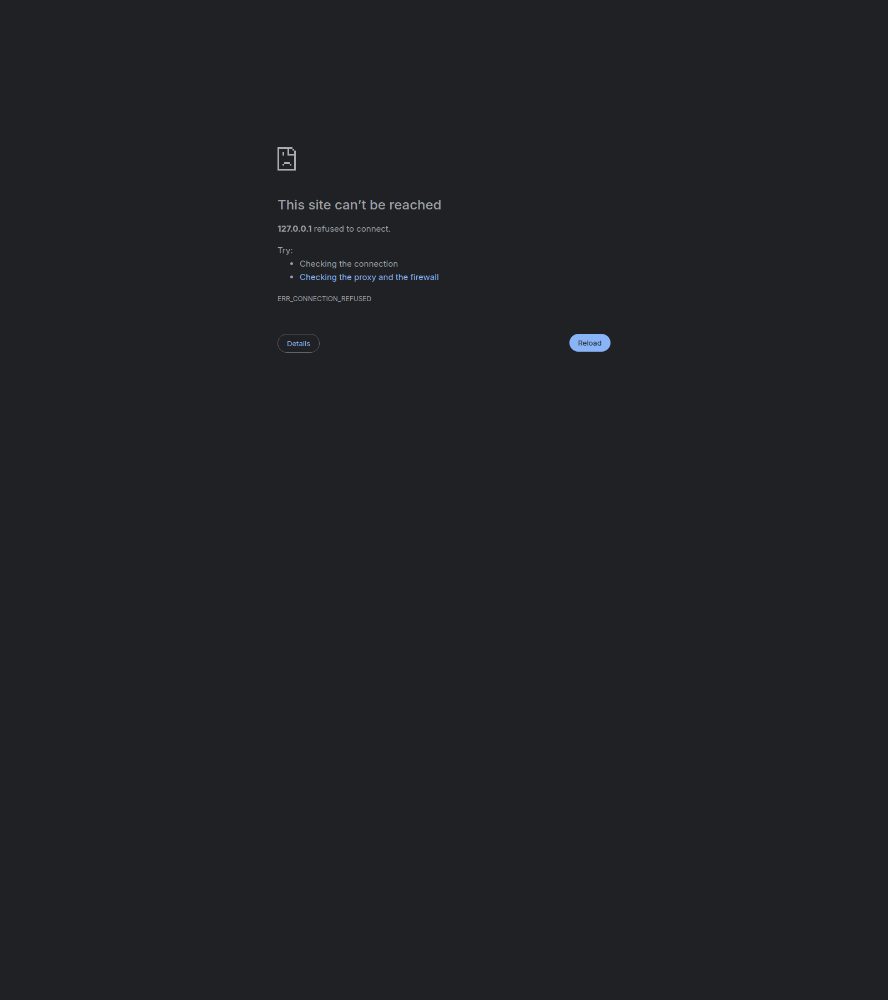
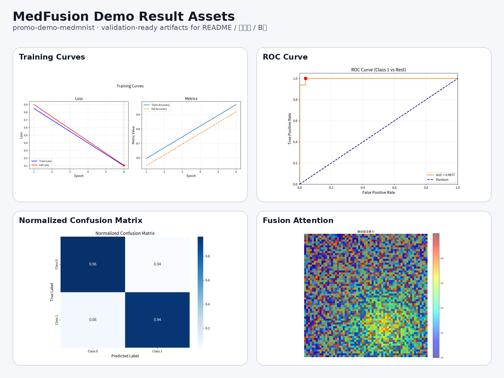

  

    MedFusion Promo MVP
  

  <h1 class="leading-tight">
    给导师和医生演示医学 AI 
    不该再从终端开始
  </h1>
  

    小红书 / B 站口播版
  

  

    演示型 MVP，不夸大为完整生产平台
  

---
layout: two-cols
---

# 这一版要解决什么

  

    
先让人看懂

    

      数据集、训练过程、结果页和报告能被非工程用户理解。
    

  

  

    
先让演示稳定

    

      打开页面后不露怯，录屏时不会点到明显空壳。
    

  

  

    
先让结果能截图

    

      ROC、混淆矩阵、注意力图、validation 摘要必须能拿出来展示。
    

  

::right::

# 这一版不做什么

  

    不吹成“全功能多模态平台”
  

  

    不在公开内容里碰复杂工作流编排
  

  

    不把 demo 感很重的伪数据当成真实交付能力
  

  

    不承诺已经生产可用
  

---

# 演示闭环只有四步

  

    
Step 1

    
注册数据集

    

      把本地目录、样本数、类别数和说明先放到台面上。
    

  

  

    
Step 2

    
发起训练

    

      用一套最小配置直接启动任务，而不是讲半天命令行。
    

  

  

    
Step 3

    
看训练过程

    

      让观众看到进度、epoch、loss、accuracy 在推进。
    

  

  

    
Step 4

    
看结果产物

    

      模型记录、图表、validation 和报告自动沉淀。
    

  

---
layout: two-cols
---

# 现在的结果页长这样

  重点不是“训练结束”四个字，而是把结果页做成真的能讲、能截图、能转化的页面。

  

    指标卡：AUC、宏平均 F1、Balanced Accuracy、Specificity
  

  

    图表区：ROC、训练曲线、混淆矩阵、归一化混淆矩阵
  

  

    Validation：per-class、阈值分析、ECE、Brier Score、误分类摘要
  

  

    多模态展示：注意力图、注意力统计图、结果文件下载
  

::right::

  

---

# 这批图已经可以直接拿去做内容

  

    
  

  

    

      README 可以直接展示训练曲线、ROC、归一化混淆矩阵和注意力图。
    

    

      小红书更适合用“结果页 + 一张拼图”做第一眼吸引。
    

    

      B 站更适合把 validation、artifact、报告链路讲完整。
    

  

---

# 没有私有数据也能先试

  

    
最快开始

    
MedMNIST

    

      最适合验证训练、结果页和报告链路。
    

  

  

    
表格任务

    
UCI Heart Disease

    

      先把 tabular 主链和指标输出跑通。
    

  

  

    
真实医学影像

    
ISIC / HAM10000 / ChestXray14

    

      更适合对外展示和后续做论文风格验证。
    

  

  重点不是“收很多数据集”，而是先给内容用户一个看完就能自己试的入口。

---
layout: two-cols
---

# 传播线和交付线要一起讲清楚

  

    
传播展示线

    

      负责让导师、医生、研究生第一眼看懂，愿意停留和咨询。
    

  

  

    
实用交付线

    

      负责真实训练、artifact、validation、报告和复现能力。
    

  

::right::

# 后续亮点怎么讲

  

    现在主打：数据集 -> 训练 -> 结果 -> 报告
  

  

    下一步主打：公开数据集快速验证
  

  

    未来亮点：参考 ComfyUI 的节点式拖拽搭建器
  

  

    但要明确：节点式搭建是 roadmap，不是假装已经做完
  

---

# 同一套内容，两个平台两种说法

  

    
小红书

    

      
时长：60 到 90 秒

      
重点：画面舒服、第一句抓人、结果页好看

      
结构：痛点 -> 演示闭环 -> 结果页 -> CTA

      
更适合用“导师汇报、组会展示、项目介绍”这种表达

    

  

  

    
B 站

    

      
时长：3 到 5 分钟起步

      
重点：把 validation、artifact、公开数据集入口讲清楚

      
结构：背景 -> 产品思路 -> Demo -> 技术可信度 -> roadmap

      
更适合顺带讲“为什么我不想再只用命令行演示”

    

  

---
layout: center
---

  

    Closing
  

  <h1 class="leading-tight">
    先把结果讲清楚 
    再把能力做扎实
  </h1>
  

    MedFusion 当前更适合被定义为一套适合演示、教学、沟通和早期项目展示的医学 AI Web 控制台。
  

  

    后续内容可以继续围绕公开数据集验证、结果页强化和节点式搭建器 roadmap 展开。
  

